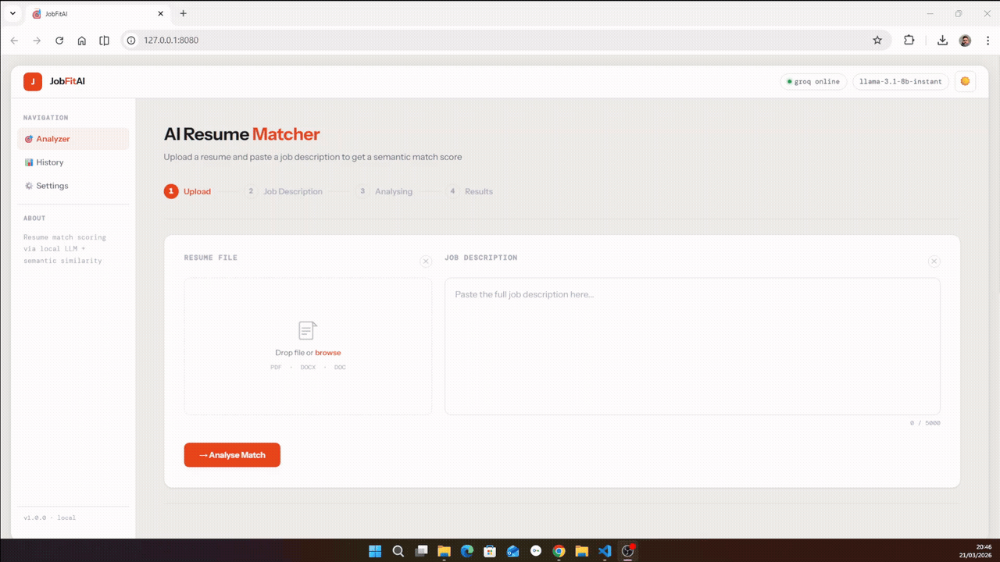

<div align="center">
 


 


 
# JobFitAI 🎯

### Stop applying blind. Know your fit before you apply.
 
*Before I apply for any job I want to know three things.*
*Am I a good fit. What keywords am I missing. Is this role even worth my time.*
*JobFitAI answers all three in seconds.*
*JobFitAI answers all three in seconds. Paste the job description, upload your resume, and get a structured breakdown of exactly where you stand before you modify or write  a single line of a resume or cover letter.*
 
[](https://linkedin.com/in/harmandeep/)
[](https://github.com/harmandeep2993)
 
</div>



---

## 🧠 Why I Built This
 
The job search process is designed to be opaque for candidates. Companies run resumes through automated filters and candidates have no visibility into what those filters are looking for. You apply, you wait, you hear nothing, and you have no idea why.
 
I wanted to fix that for myself first. I needed a tool that would look at any job description and tell me clearly what the role requires, how well my profile matches it, and what I would need to close the gap. Not a generic resume score. A specific analysis against a specific job every single time.
 
So I **built** it. It is still being built. But the core of it works and I use it for every role I consider applying to.

---

## ✨ What It Does
 
Upload your resume and paste a job description. JobFitAI reads both documents, understands the content, and produces a detailed match report in seconds.
 
You get an overall score, a breakdown across every section of your profile, a full skills gap analysis showing exactly what you have and what you are missing, and a set of actionable recommendations telling you what to fix before you apply.
 
The scoring is not keyword matching. If your resume says you built ML pipelines and the job asks for machine learning experience that is a match. If the JD is written in German and your resume is in English that still works. The system understands meaning not just exact words.
 

 
---
 
## 📊 What You Get
 
After analysis you get five tabs of information.
 
**📋 Summary** is a plain language narrative of your candidacy against this specific role. Your score, your strengths, your gaps, and a direct recommendation.
 
**Match Breakdown** shows your score across every section so you know exactly where you are strong and where you are losing points.
 
**Skills Gap** shows the full keyword picture. Which required skills you have, which you are missing, and which preferred skills are absent from your profile. This is the tab I use most before tailoring a resume.
 
**Languages** compares your language proficiency against what the role requires with full support for CEFR levels and native language names across all European languages.
 
**💡 Recommendations** gives you specific actions ranked by impact. Fix these things and your score goes up.
 
---
 
## 🏷️ Score Labels
 
| Score | Label |
|---|---|
| 80 and above | Excellent Match 🟢 |
| 60 to 79 | Good Match 🟡 |
| 40 to 59 | Partial Match 🟠 |
| Below 40 | Poor Match 🔴 |
 
---
 
## 🛠️ Tech Stack
 
| Layer | Technology |
|---|---|
| Frontend | NiceGUI |
| PDF Parsing | pdfplumber → PyMuPDF → OCR (3 tier fallback) |
| LLM Extraction | OpenAI gpt-4o-mini / Groq llama-3.1-8b / Ollama |
| Semantic Matching | sentence-transformers |
| Configuration | YAML + .env |
| Logging | Loguru |
 
---
 
## 🤖 Supported LLM Providers
 
| Provider | Model | Notes |
|---|---|---|
| OpenAI | gpt-4o-mini | Best extraction quality |
| Groq | llama-3.1-8b-instant | Fast, free tier available |
| Gemini | gemini-1.5-pro | In progress |
| HuggingFace | meta-llama/Llama-3.1-8B | In progress |
| Ollama | qwen2.5:3b | Fully local, no API key needed |
 
Switch providers by changing `ACTIVE_PROVIDER` in `src/utils/router.py`. UI based provider toggle is coming soon.
 
---
 
## 📄 Supported File Formats
 
| Format | Notes |
|---|---|
| PDF (text based) | Standard resumes |
| PDF (complex layout) | Multi column, graphic heavy |
| PDF (scanned) | Requires tesseract and poppler |
| DOCX | Full paragraph and table extraction |
| TXT | Direct read with encoding fallback |
 
---
 
## 🌍 Language Support
 
Resumes and job descriptions written in any European language are automatically extracted and normalised to English before matching. This means a German JD and an English resume score correctly against each other without any extra setup.
 
---
 
## 🗂️ Project Structure
 
```
JobFitAI/
│
├── app.py                        NiceGUI entry point
├── main.py                       CLI entry point
├── config.yaml                   All provider configs, weights, and limits
│
├── schemas/
│   ├── resume_schema.json        JSON schema the LLM fills for resumes
│   └── jd_schema.json            JSON schema the LLM fills for job descriptions
│
├── src/
│   ├── parsers/                  Everything to do with reading files
│   │   ├── pdf_parser.py         
│   │   ├── docx_parser.py        
│   │   ├── text_cleaner.py       
│   │   ├── resume_parser.py      
│   │   └── validator.py          
│   │
│   ├── extractors/               Sends parsed text to the LLM and gets structured data back
│   │   ├── pipeline.py           
│   │   ├── resume.py             
│   │   └── jd.py                 
│   │
│   ├── prompts/                  Builds the prompts sent to the LLM
│   │   ├── resume_prompt.py      Resume extraction prompt with schema
│   │   └── jd_prompt.py          JD extraction prompt with schema
│   │
│   ├── matcher/                  Scores the resume against the JD
│   │   ├── matcher.py            Runs all scorers and combines into a final score
│   │   ├── embedding_model.py    
│   │   ├── utils.py              
│   │   └── scores/               One file per scoring dimension
│   │       ├── skills.py         
│   │       ├── responsibilities.py 
│   │       ├── experience.py    
│   │       ├── education.py     
│   │       ├── languages.py      
│   │       └── certifications.py 
│   │
│   ├── services/                 Higher level features built on top of the core pipeline
│   │   └── summary.py           
│   │
│   ├── frontend/                 The NiceGUI web interface
│   │   ├── handlers.py           
│   │   ├── layout.py            
│   │   ├── components.py        
│   │   └── results.py           
│   │
│   └── utils/                    Shared infrastructure used by everything
│       ├── config.py            
│       ├── logger.py             
│       ├── router.py             
│       └── providers/            One file per LLM provider
│           ├── openai.py
│           ├── groq.py
│           ├── gemini.py
│           ├── huggingface.py
│           └── ollama.py
│
└── assets/                       Static files served by NiceGUI
    ├── css/
    └── js/
```
---
 
## 🚀 Setup
 
Clone the repo first.
 
```bash
git clone https://github.com/harmandeep2993/JobFitAI
cd JobFitAI
```
 
Then choose your preferred package manager.
 
**Using pip**
 
```bash
python -m venv .venv
 
# Windows
.venv\Scripts\activate
 
# Linux / Mac
source .venv/bin/activate
 
pip install -r requirements.txt
```
 
**Using uv** (faster, recommended)
 
```bash
# Install uv if you don't have it
pip install uv
 
# Create environment and install dependencies in one step
uv venv
uv pip install -r requirements.txt
 
# Activate
# Windows
.venv\Scripts\activate
 
# Linux / Mac
source .venv/bin/activate
```
 
**Add your API keys**
 
```bash
cp .env.example .env
```
 
Open `.env` and add your key for whichever provider you want to use.
 
```
OPENAI_API_KEY=sk_xxx
GROQ_API_KEY=gsk_xxx
GEMINI_API_KEY=xxx
HUGGINGFACE_API_KEY=hf_xxx
```
 
**Run**
 
```bash
python app.py
# Open http://localhost:8080
```
 
For fully local usage with no API key install [Ollama](https://ollama.com) and set `ACTIVE_PROVIDER = "ollama"` in `src/utils/router.py`.
 
---
 
## 📍 Current Status
 
The core pipeline works end to end. Resume parsing, LLM extraction, semantic matching, skills gap analysis, and the results UI are all functional. I use it regularly for my own job search.
 
**Still in progress: LLM summary narrative generation, UI based provider toggle, and resume improvement suggestions.**
 
---
  
## 🤝 Contributing
 
This started as a personal tool and I am planing it to grow something bigger. If you interested and willilng to contribute or has ideas for features that would actually help candidates reach out. Let connect and discuss.
 
---
 
## 👋 Connect
 
Built by Harman. Open to feedback, ideas, and conversations about making the job search less of a black box.
 
[](https://linkedin.com/in/harmandeep)
[](https://github.com/harmandeep2993)
---
 
## 📜 License

This project is not yet licensed for public use.
Planned to be released under MIT License upon stable release.
